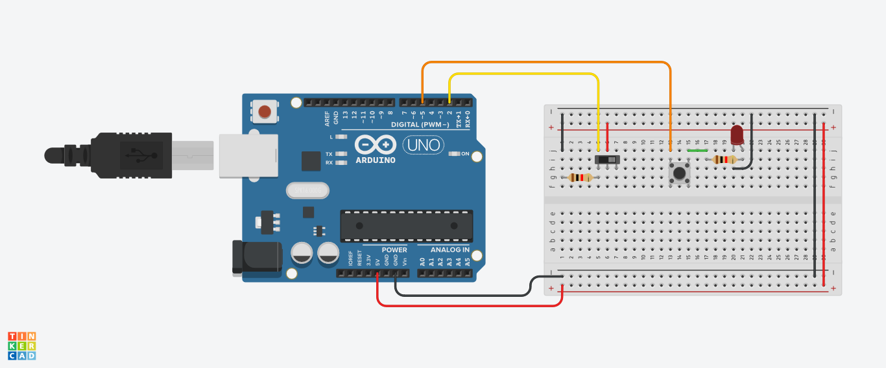

# Clase de bloque general
En esta se presentó la escencia de la computación y cómo se ha relacionado con la cohetería en
distintas áreas, la presentación utilizada se puede ver en el PDF `presentacion-0.pdf` y también se
realizó un ejemplo simple de Arduino en el simulador web tinkercad, esta simulación puede ser
accedida [por acá](https://www.tinkercad.com/things/eZo10X0vsAK) y el código escrito también se
encuentra en el archivo `main.ino`

    

